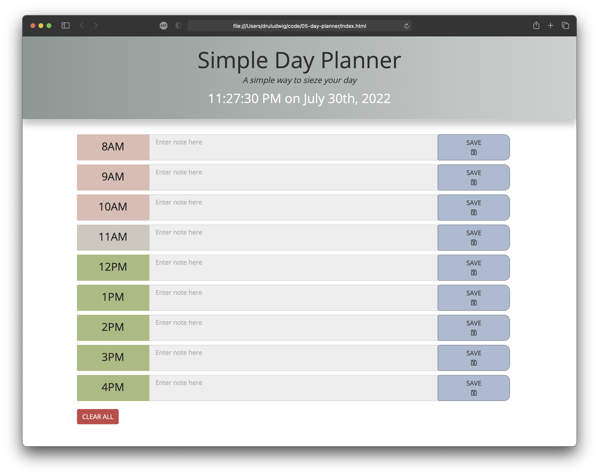

# Day Planner 1.0
Launch App: https://druludwig.github.io/05-day-planner/
## Description
Plan your day. Simply.

## User Friendly Features
- A large built in clock keeps the user on track
- Data remains saved if the user leaves the page or closes the browser
- Save feature is communicated visually with an icon <em>and</em> text
- Quickly start a new day with a <strong>CLEAR ALL</strong> button

## Notes
Many hours went into minimizing the code -- and being completely new to Javascript, I may have taken some unorthodox approaches. I'm looking forward to revisiting this project in the future to retrofit the code and implement a couple new features.

## Next Version
- Allow user to customize the range of available hours
- Allow user to print a formatted version of the planner

## Screenshot

